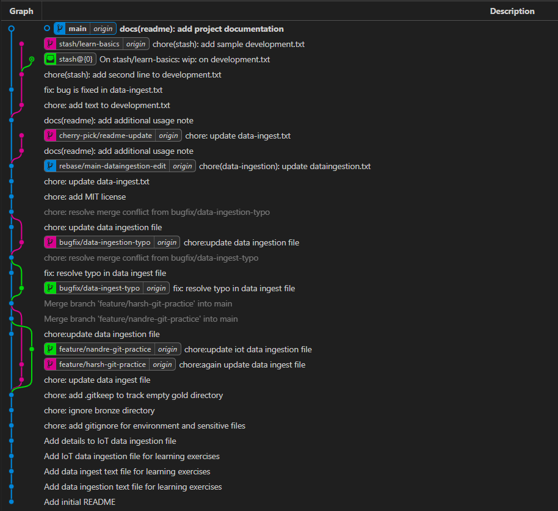

# Git Mastery: From Basics to Advanced Workflows 🚀

Welcome to the **Git Mastery** repository! This is a hands-on, text-based sandbox designed to help you move beyond `git commit` and `git push`. By using simple text files, this repo focuses purely on the logic and mechanics of Git without the distraction of complex code.

## 📖 Table of Contents
- [Project Goals](#project-goals)
- [Topics Covered](#topics-covered)
- [Branching Strategy](#branching-strategy)
- [How to Use This Repo](#how-to-use-this-repo)
- [Best Practices](#best-practices)

---

## 🎯 Project Goals
The primary objective of this repository is to provide a safe environment to practice:
* **Version Control Foundations:** Understanding the staging area and commit history.
* **Advanced Maneuvers:** Master rebasing, cherry-picking, and resolving merge conflicts.
* **Repository Hygiene:** Learning how to manage hidden files and directory structures.
* **Professional Workflows:** Simulating real-world industry standards.

---

## 🛠 Topics Covered

### 1. Basic Operations
* Initializing repositories and tracking files.
* The difference between `git add`, `git commit`, and `git status`.

### 2. Branching & Merging
* **Feature Branching:** Creating isolated environments for new "features."
* **Fast-forward vs. Three-way Merges:** Understanding how Git joins history.

### 3. Advanced Git Magic 🪄
* **Rebasing:** Keeping a linear history by moving your work to the tip of the main branch.
* **Cherry-picking:** Grabbing a specific commit from one branch and applying it to another.
* **Stashing:** (tracked & untracked files)
* **Reflog and recovery**
* **Reset**

### 4. Repository Management
* **.gitignore:** How to keep junk (logs, temp files) out of your repo.
* **.gitkeep:** A clever trick to track empty directories in Git.

---

## 🗂 Repository Structure

This repository is organized to help you navigate through different Git concepts systematically:

```text
.
├── Assets/
│   └── git-graph.png          # Visual representation of the Git history
├── bronze/
│   └── bronze-data.txt        # Initial raw data exercise file
├── gold/
│   └── .gitkeep               # Ensures the directory is tracked even if empty
├── .env                       # Example environment file (should be ignored!)
├── .gitignore                 # Rules for files Git should not track
├── api-secrets.txt            # Practice file for sensitive data management
├── data-ingest.txt            # Basic ingestion practice file
├── data-ingestion.txt         # Data flow practice file
├── iot-data-ingestion.txt     # Specialized data flow practice file
├── LICENSE                    # MIT License for the project
└── README.md                  # Project documentation and guide
```
> Files are intentionally simple so the focus stays on **Git concepts**, not code complexity.

---

## 🌲 Branching Strategy
This repo follows a simplified **Git Flow** model to simulate professional environments:
* `main`: The "production-ready" stable history.
* `develop`: The integration branch for features.
* `feature/*`: Individual branches for specific learning exercises.

### Visualizing the Workflow
Below is a representation of how the commit history looks when using this strategy:

<p align="center">
  
</p>

---

## 🚀 How to Use This Repo

1.  **Clone the Repo:**
    ```bash
    git clone [https://github.com/your-username/your-repo-name.git](https://github.com/your-username/your-repo-name.git)
    ```
2.  **Explore the Exercises:** Check the `exercises/` folder for text-based prompts.
3.  **Practice:** Follow the instructions in each file to perform specific Git commands.
4.  **Break Things:** Don't be afraid to cause a merge conflict—that's the best way to learn how to fix them!

---

## 💡 Pro-Tips
> **Note:** Always run `git status` before and after every command. It is the best way to visualize what is happening in the background.

---

## 🤝 Contributing
If you have a specific Git workflow or a tricky scenario you'd like to add, feel free to fork this repo and submit a Pull Request!

---

## 📄 License
This project is licensed under the **MIT License**. 

---

*Happy Branching!*